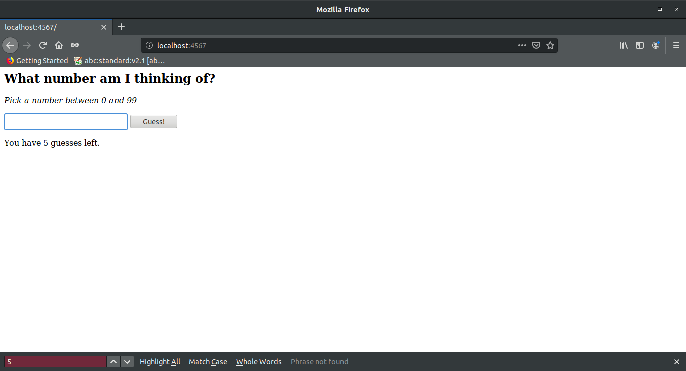

# WebGuesser
An internet app guessing game made in Sinatra.

## Installation
  * Prerequisites:
    * Ruby (installation info at `https://www.ruby-lang.org/en/documentation/installation/`)
    * Sinatra (enter `gem install sinatra` in the terminal)
  * Clone the repo at `https://github.com/celloward/webguesser`

## Usage
For local use:
  * From inside the root cloned folder in the terminal enter `ruby web_guesser.rb`
  * Open internet browser and enter url `localhost:4567/`
  * Play the game.
  * To stop the internal server, press `Ctl + C` or `Cmd + C` in the terminal.

## Acknowlegement
This app was developed based on a tutorial from <a href="http://tutorials.jumpstartlab.com/projects/web_guesser.html">Jumpstart Lab</a>.
